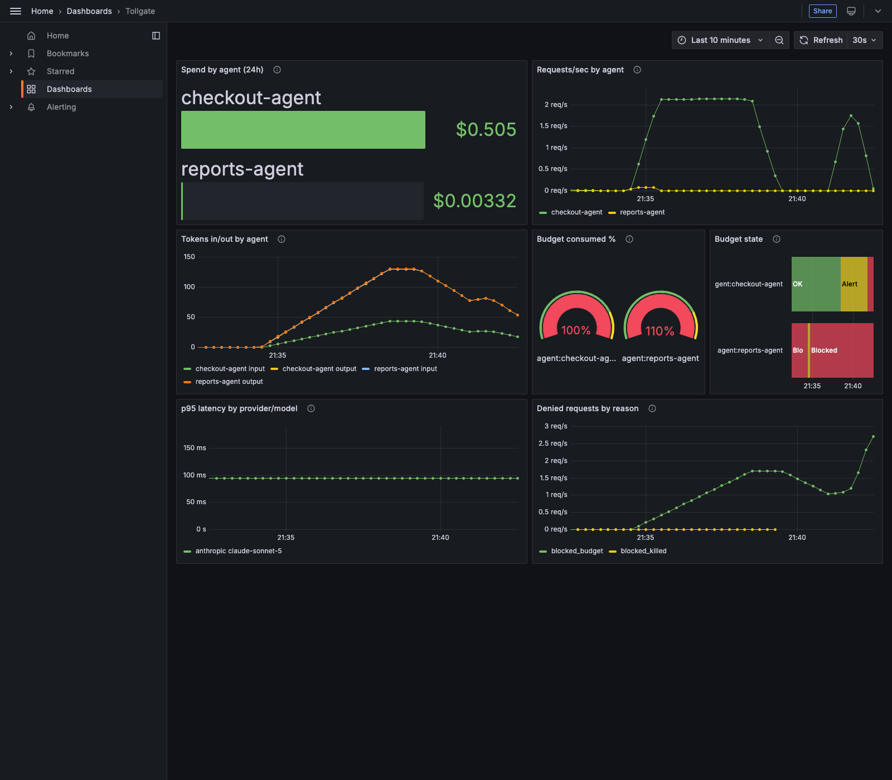

# Tollgate

[](https://github.com/opslync/tollgate/actions/workflows/ci.yml)
[](LICENSE)
[](https://github.com/opslync/tollgate/pkgs/container/tollgate)


**See, budget, and control every token your AI agents spend — inside your own cluster.**

An agent with an API key can spend without limit and without anyone noticing until the invoice arrives. Multiply that by every agent, every team, every namespace in the cluster, and "who spent what" becomes a question nobody can answer in real time — usually you find out from the bill, not from a dashboard, and by then the runaway loop has been running for hours. Tollgate sits between your agents and the LLM APIs they call, so every request is attributed to an identity the moment it happens, every budget is enforced before the next token is spent, and a kill switch stops a specific agent in milliseconds — not at the next billing cycle.

## Try it in one command

No cluster, no API key, no config file to hand-edit — this is the exact scenario in the GIF above, running locally:

```sh
git clone https://github.com/opslync/tollgate.git && cd tollgate/deploy/compose
./demo.sh up      # builds and starts Tollgate + a mock upstream + Prometheus + Grafana
./demo.sh trip     # sends traffic until the demo budget alerts, then hard-blocks
```

Grafana's at `localhost:3000` (admin/admin) with the dashboard already loaded. See [`deploy/compose`](deploy/compose) for the rest of `demo.sh` (`status`, `kill`, `revive`) and what each service is doing.

## What it does

- **Attribution** — every request is tagged with an agent identity (API key, or ServiceAccount-bound identity in Kubernetes — no key needed). Token usage is parsed from provider responses and attributed to agent, team, and namespace.
- **Budgets with real-time enforcement** — not retrospective reporting. Per-agent or per-team token/dollar budgets: alert at threshold, throttle or hard-block at limit, and a kill switch that stops a runaway agent loop in seconds.
- **Audit** — every LLM call (and later, MCP tool call) logged: agent, model, tokens, cost, latency, status, timestamp.

Cost governance is the wedge; MCP tool-call policy (allow-lists, deny-by-default) rides on the same chassis later.

## See it in Grafana



`/metrics` is always on, no config needed. Wiring it into an existing Grafana takes about 10 minutes — see [`docs/grafana.md`](docs/grafana.md).

## Architecture


Single Go binary, three middleware stages, SQLite for storage. Full request-flow breakdown and package layout in [`ARCHITECTURE.md`](ARCHITECTURE.md).

## How it compares

|  | **Tollgate** | LLM gateways (LiteLLM, Portkey, ...) | Observability tools (Langfuse, Helicone, ...) | Cloud billing dashboards |
|---|---|---|---|---|
| Primary job | Governance: attribute, budget, block | Routing, fallback, caching across providers | See what happened after the fact | See what you were billed after the fact |
| Runs where | In your cluster, your data never leaves | Usually your infra | Usually their SaaS | Vendor's cloud |
| Per-agent/team attribution | Yes — API key or K8s ServiceAccount identity | Via API keys | Via SDK-side tagging | No — account-level only |
| Real-time hard enforcement | Yes — block/throttle before the next token is spent | Varies by setup | No — observability only | No — hours-delayed at best |
| Kill switch | Yes, sub-second, survives restarts | No | No | No |
| MCP tool-call governance | Roadmapped (allow-lists, deny-by-default) | No | No | No |
| Install | Single static binary + SQLite | Varies | Hosted signup | N/A |

Tollgate deliberately doesn't do model routing, fallback, or caching — that's the gateways' fight, and mixing it in dilutes what Tollgate is actually for.

## Other ways to run it

<details>
<summary>Local binary</summary>

```sh
make build
cp config.example.yaml config.yaml   # add your provider key + agent keys
./bin/tollgate --config config.yaml
```

Point your agent at Tollgate instead of the provider, using its Tollgate agent key in place of the provider key:

```sh
export ANTHROPIC_BASE_URL=http://localhost:8080
export ANTHROPIC_API_KEY=tg_your_agent_key   # terminated at Tollgate, never sent upstream
```

Every request produces a structured log line and a persisted SQLite row with dollar cost (from the versioned [pricing table](pricing/pricing.yaml), fixed at request time):

```
msg=request provider=anthropic path=/v1/messages status=200 agent=support-bot team=support namespace=prod model=claude-sonnet-5 stream=false input_tokens=25 output_tokens=50
```

```sh
curl "http://localhost:8080/usage?group_by=agent&since=24h" -H "x-api-key: $TOLLGATE_KEY"
```

```json
{"group_by":"agent","rows":[
  {"key":"support-bot","requests":3,"input_tokens":522,"output_tokens":191,"cost_usd":0.004866}
]}
```

`group_by` accepts `agent`, `team`, `namespace`, `model`, or `provider`; `since`/`until` take durations (`24h`) or RFC3339 timestamps; `agent=`/`model=` filter.

</details>

<details>
<summary>Budgets and the kill switch</summary>

```yaml
budgets:
  - agent: support-bot
    window: 24h
    limit_usd: 10.00
    action: block        # or throttle: 429 + Retry-After, one request per interval
```

At 80% of the limit (configurable) Tollgate logs a warning; at the limit it blocks with a `budget_exceeded` error or throttles with `rate_limit_error` — both in the Anthropic error shape, so SDKs back off natively. And when something is truly on fire:

```sh
curl -X POST http://localhost:8080/admin/agents/support-bot/kill -H "x-admin-key: $ADMIN_KEY"
```

The kill takes effect on the very next request (milliseconds, not minutes), survives restarts, and lifts with `DELETE` on the same path.

</details>

<details>
<summary>OpenAI-compatible providers (vLLM and friends)</summary>

Add an `openai`-type provider and OpenAI-style paths route to it — one Tollgate instance fronts both APIs, and a single agent identity and budget follow the agent across providers:

```yaml
providers:
  - name: anthropic
    base_url: "https://api.anthropic.com"
    api_key: "${ANTHROPIC_API_KEY}"
  - name: vllm
    type: openai
    base_url: "http://vllm.internal:8000"
```

OpenAI SDK users set `OPENAI_BASE_URL=http://tollgate:8080/v1` and their Tollgate agent key as the API key. For streaming token counts, request `stream_options: {"include_usage": true}` (vLLM emits the usage chunk the same way).

</details>

<details>
<summary>Kubernetes (kind quickstart)</summary>

Try the full in-cluster experience in ~2 minutes with [kind](https://kind.sigs.k8s.io/):

```sh
kind create cluster --name tollgate
docker build -t tollgate:dev .
kind load docker-image tollgate:dev --name tollgate

kubectl create secret generic tollgate-keys \
  --from-literal=ANTHROPIC_API_KEY=sk-ant-... \
  --from-literal=TOLLGATE_ADMIN_KEY=$(openssl rand -hex 16)

cat > my-values.yaml <<'EOF'
image: {repository: tollgate, tag: dev}
existingSecret: tollgate-keys
config:
  server: {listen: ":8080", admin_key: "${TOLLGATE_ADMIN_KEY}"}
  storage: {path: "/data/tollgate.db"}
  providers:
    - name: anthropic
      base_url: "https://api.anthropic.com"
      api_key: "${ANTHROPIC_API_KEY}"
  agents:
    - {name: my-agent, key: "tg_change_me_0123456789abcdef", team: demo}
  budgets:
    - {agent: my-agent, window: 24h, limit_usd: 5.00, action: block}
EOF

helm install tollgate deploy/helm/tollgate -f my-values.yaml
kubectl port-forward svc/tollgate 8080:8080 &

export ANTHROPIC_BASE_URL=http://localhost:8080
export ANTHROPIC_API_KEY=tg_change_me_0123456789abcdef
# ... run your agent, then ask who spent what:
curl "http://localhost:8080/usage" -H "x-api-key: $ANTHROPIC_API_KEY"
```

In production, agents in the cluster point at `http://tollgate.<namespace>.svc:8080` and the chart's `persistence.enabled=true` keeps usage history and kill-switch state across restarts. Want the Grafana dashboard populated too? See [`values-demo.yaml`](deploy/helm/tollgate/values-demo.yaml) and [`docs/grafana.md`](docs/grafana.md).

</details>

## Design principles

- **Provider-transparent.** Agents just change their base URL. Requests are forwarded unmodified; responses (including streaming) are parsed for usage on the way through.
- **Zero-dependency install.** Single static Go binary, SQLite storage, one YAML config file. Runs locally with nothing else; a [Helm chart](deploy/helm/tollgate) packages it for Kubernetes.
- **Open source.** Apache-2.0.

## Roadmap

| Milestone | Scope |
|---|---|
| 1–6 ✅ | Passthrough proxy, agent identity, SQLite metering + `GET /usage`, budgets + kill switch, OpenAI-compatible endpoints, Helm/kind packaging |
| 7 ✅ | Kubernetes-native identity — ServiceAccount attribution, team mapping |
| 8 ✅ | Prometheus metrics + OTel tracing + Grafana dashboard |
| 9 | MCP passthrough + audit-only logging |
| 10 | General policy engine (budgets refactor onto it, dry-run mode) |
| 11 | MCP tool-call enforcement — allow-lists, deny-by-default, approval gates |
| 12 | Audit export & compliance pack |

Full scope and sequencing rationale in [`ROADMAP.md`](ROADMAP.md); tracked issues on the [milestones page](https://github.com/opslync/tollgate/milestones).

## License

[Apache-2.0](LICENSE)
