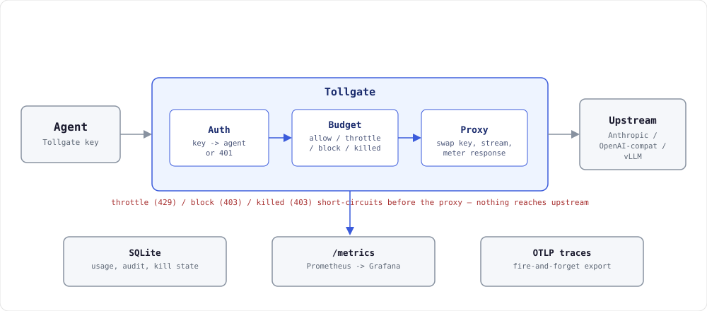

# Tollgate

**See, budget, and control every token and tool call your AI agents make inside your own cluster.**

An agent with an API key can spend without limit and without anyone noticing until the invoice arrives. Multiply that by every agent, every team, every namespace in the cluster, and "who spent what" becomes a question nobody can answer in real time. Tollgate sits between your agents and the LLM APIs they call, so every request is attributed to an identity the moment it happens, every budget is enforced before the next token is spent, and a kill switch stops a specific agent in milliseconds — not at the next billing cycle.

It's a single static Go binary with SQLite storage and one YAML config file. Agents don't change their code — they change their base URL.

## Start here

- **[Quickstart: Docker Compose](quickstart-compose.md)** — the fastest path. No cluster, no API key, no config to hand-edit. Two commands and you're watching a budget trip in Grafana.
- **[Quickstart: Kubernetes](quickstart-k8s.md)** — the full in-cluster experience on [kind](https://kind.sigs.k8s.io/) in about two minutes, via the Helm chart.

Then: the [configuration reference](configuration.md) for every key in `config.yaml`, and the [Grafana walkthrough](grafana.md) for wiring `/metrics` into an existing Prometheus Operator setup.

## The three pillars

**Attribution.** Every request is tagged with an agent identity — an API key per agent, or a ServiceAccount-bound identity in Kubernetes with no key at all. A key can be copied, shared, or pasted into a notebook; a ServiceAccount binding is controlled by the platform team, and an agent can't claim to be a different one. Token usage is parsed out of provider responses and attributed to agent, team, and namespace.

**Budgets with real-time enforcement.** Not retrospective reporting. Per-agent or per-team token or dollar budgets over a rolling window: log a warning at a threshold, then throttle (`429` + `Retry-After`) or hard-block (`403`) at the limit. Enforcement errors use the Anthropic error shape, so SDKs back off natively. The kill switch stops a runaway agent loop on its very next request and survives a restart.

**Audit.** Every LLM call — and later, every MCP tool call — logged with agent, model, tokens, cost, latency, status, and timestamp, persisted to SQLite and queryable over `GET /usage`.

## How it fits together

Three middleware stages in order — auth, budget, proxy. Requests are forwarded unmodified; responses (including streaming SSE) are parsed for usage on the way through, and cost is computed at request time from a [versioned pricing table](https://github.com/opslync/tollgate/blob/main/pricing/pricing.yaml) so later price changes never rewrite history. Anthropic and OpenAI-compatible endpoints (including vLLM) are both supported, routed by path, behind one agent identity and one budget.

Full request-flow breakdown and package layout: [`ARCHITECTURE.md`](https://github.com/opslync/tollgate/blob/main/ARCHITECTURE.md).

## What we guarantee about the numbers

Tollgate's whole job is to say how much an agent has spent and stop it before it spends too much, so the spend figures have to hold up under restarts, concurrency, cancellation, and adversarial input. [Correctness](correctness.md) is the invariant table and the test suite that proves each one — including the two bounds that don't fully close, published rather than hidden.

The story of writing that suite, and the three bugs it found: [Three bugs I found writing tests for my own budget enforcement](blog/testing-budget-enforcement.md).

## What Tollgate deliberately doesn't do

No model routing, fallback, or caching. That's the LLM gateways' fight, and mixing it in dilutes what Tollgate is actually for. See the [roadmap](roadmap.md) for what is coming — MCP passthrough and audit, a general policy engine, MCP tool-call enforcement, and compliance export.

## License

[Apache-2.0](https://github.com/opslync/tollgate/blob/main/LICENSE).
